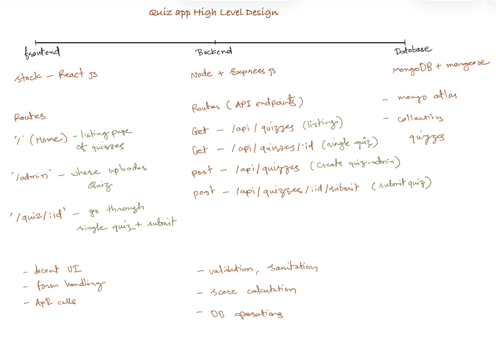

# Quiz App

**Live Demo:** [https://quizzywebapp.netlify.app/](https://quizzywebapp.netlify.app/)

## High-Level Design Diagram

## 1. High-Level Overview

A simple Quiz Management System with:

- **Frontend:** React JS
- **Backend:** Node.js + Express
- **Database:** MongoDB Atlas via Mongoose

Core idea:  
Admin can create quizzes, users can see the list of quizzes, attempt a single quiz, submit answers, and get a score.

---

## 2. Frontend (React)

**Stack:** React JS

**Main Routes**

- `/`

  - Home page
  - List all quizzes (title, description, total questions, etc.)

- `/admin`

  - Admin page to create/upload a new quiz
  - Form to add: quiz title, description, questions, options, correct answer, and marks

- `/quiz/:id`
  - Page to go through a single quiz
  - Shows questions one by one or all at once
  - On submit, calls backend to calculate score and shows result

**Frontend Responsibilities**

- Decent, clean UI
- Form handling (quiz creation, quiz attempt)
- API calls to backend (using fetch/axios)
- Basic validation on forms (required fields, etc.)

---

## 3. Backend (Node + Express)

**Stack:** Node.js + Express

**API Routes**

- `GET /api/quizzes`

  - List all quizzes

- `GET /api/quizzes/:id`

  - Fetch a single quiz by ID

- `POST /api/quizzes`

  - Create a new quiz (admin)
  - Body includes quiz meta + questions

- `POST /api/quizzes/:id/submit`
  - Submit answers for a quiz
  - Body includes user’s selected options
  - Returns calculated score and optional summary

**Backend Responsibilities**

- Validation & sanitization of incoming data
- Score calculation logic
- Database operations (CRUD on quizzes collection)
- Basic error handling and proper HTTP status codes
- CORS setup for React frontend

---

## 4. Database (MongoDB + Mongoose)

**Stack:** MongoDB Atlas with Mongoose

**Collections**

- `quizzes`
  - Basic fields:
    - `_id`
    - `title`
    - `description`
    - `questions` (array)
      - `questionText`
      - `options` (array of strings)
      - `correctOptionIndex` (or `correctAnswer`)
      - `marks` (optional)
    - `createdAt`
    - `updatedAt`

**DB Responsibilities**

- Persist quizzes created by admin
- Efficiently fetch quiz list and single quiz
- No need to store submissions initially (keep it simple for v1)

---

## 5. Development Steps

1. **Initialize Repos**

   - Create GitHub repo
   - Create `/frontend` and `/backend` folders (or two separate repos if preferred)

2. **Backend First**

   - Initialize Node + Express project
   - Connect to MongoDB Atlas with Mongoose
   - Define `Quiz` schema and model
   - Implement API routes:
     - `GET /api/quizzes`
     - `GET /api/quizzes/:id`
     - `POST /api/quizzes`
     - `POST /api/quizzes/:id/submit`
   - Test all endpoints using Postman

3. **Frontend**

   - Initialize React app
   - Set up React Router with:
     - `/`
     - `/admin`
     - `/quiz/:id`
   - Implement pages:
     - **Home:** fetch and display quizzes list
     - **Admin:** form to create quiz and POST to backend
     - **Quiz Detail:** fetch quiz by ID, render questions, submit answers to backend and show score

4. **Integration & Polish**

   - Connect frontend to backend APIs
   - Handle loading, error states, and basic validation
   - Do a quick UI cleanup (simple but professional)

5. **Deployment**
   - Deploy backend (e.g., Render / Railway / Heroku alternative / VPS)
   - Deploy frontend (e.g., Netlify / Vercel)
   - Update **Live Demo** link at the top of this file

---

## 6. If I Had More Time (Next Steps)

If I had more time, I would extend this system in a few directions:

1. **User Accounts (Sign Up / Sign In)**

   - Add authentication (e.g., email + password, JWT-based sessions).
   - Allow users to register and log in so quiz attempts can be linked to a specific user.
   - Basic profile page showing their name and email.

2. **Store Quiz Submissions Per User**

   - Create a separate `submissions` collection to store each quiz attempt:
     - `userId`
     - `quizId`
     - `answers`
     - `score`, `maxScore`, `correctCount`
     - `createdAt`
   - This would allow tracking history over time and prevent duplicate attempts if needed.

3. **Analytics & Charts for Admin**

   - Simple analytics dashboard for admin:
     - Average score per quiz
     - Number of attempts per quiz
     - Distribution of scores (e.g., bar chart)
   - Use a lightweight chart library on the frontend to visualize:
     - Completion rate
     - Difficult questions (questions with a low correct ratio)

4. **Feedback & Review Page for Users**

   - A “My Performance” page where logged-in users can see:
     - Past attempts
     - Scores trend over time
     - Which topics or quizzes they are strong/weak at
   - Optional feedback per quiz: users can rate difficulty and leave comments (stored and visible only to admin).

5. **Better Quiz Configuration**
   - Timer support for timed quizzes.
   - Settings like:
     - Shuffle questions
     - Shuffle options
     - Limit number of attempts per user.
